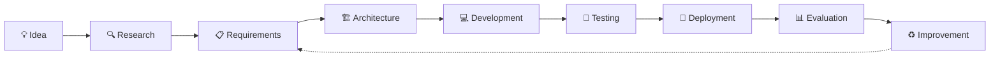

 

<table>
<tr>
<td width="60%" valign="top">

### 👩‍💻 About Me

I'm **Sayaka Alam**, CSE Graduate from **KUET** and a **Hybrid Engineer** — Developer who Tests and Tester who Builds.

My work spans **software engineering, full-stack development, QA/SQA, artificial intelligence, machine learning, computer vision, blockchain, cybersecurity, databases, networking, mobile applications, and research-oriented systems**.

I enjoy transforming ideas into complete applications through the full engineering lifecycle:

**💡 Idea → 🔍 Research → 🏗 Design → 💻 Development → 🧪 Testing → 🚀 Deployment → 📊 Evaluation**

**🟢 Immediately Available** for Full-time — Manual QA Tester, SQA Engineer, Software Testing roles.

</td>
<td width="40%" align="center">

</td>
</tr>
</table>

---

## 🎯 Areas of Focus

---

## 🧪 QA & SQA Expertise — From CV

| Category | Skills |
| :--- | :--- |
| **Testing Types** | Manual Testing, Functional Testing, Regression Testing, Integration Testing, System Testing, UAT, CRUD Testing |
| **API Testing** | Postman, REST API Testing, JSON Validation, Status Code Validation |
| **Database Testing** | SQL Queries, Data Validation, CRUD Testing, Integrity Checking, Normalization |
| **QA Process** | SDLC, STLC, Bug Life Cycle, Severity & Priority Analysis, Test Case Design, Defect Tracking |
| **QA Tools** | Jira, Test Cases, Bug Reports, Test Documentation, Git, SQL |

 

---

## 🛠️ Technical Skills — Complete Arsenal

### 👨‍💻 Programming Languages

### 🌐 Frontend Development

### ⚙️ Backend & APIs

### 🤖 AI / ML / Computer Vision

  
<code>Machine Learning</code> <code>Deep Learning</code> <code>Computer Vision</code> <code>Image Processing</code> <code>Data Analysis</code> <code>Explainable AI</code>

### 🗄️ Databases

### 🔧 Tools, DevOps & Platforms

---

## 🚀 Project Portfolio — All Features

| # | Project | Domain | Technologies | Description |
|---:|---|---|---|---|
| **01** | [⛓ EthereumHeist-System](https://github.com/SayakaMeem/EthereumHeist-System) | Blockchain / Analytics / Full-Stack | Python, Blockchain, Data Processing, Web | Blockchain analytical system with data processing, backend, frontend visualization, analytical results, and deployment. QA: Functional, Regression, API, SQL. |
| **02** | [🔐 RightsChain-X](https://github.com/SayakaMeem/RightsChain-X) | Blockchain / Cybersecurity | Python, FastAPI, JWT, SQLAlchemy, SQLite, SHA-256 | Digital evidence management platform with authentication, RBAC, cryptographic integrity, blockchain-inspired traceability, and REST APIs. |
| **03** | [🛒 ComWebP](https://github.com/SayakaMeem/ComWebP) | Full-Stack / E-Commerce | React, Vite, JavaScript, Tailwind, REST API | Responsive e-commerce platform featuring product discovery, authentication, cart, customer/admin roles, order management, APIs, and deployment. Tested for CRUD, Auth, Workflows. |
| **04** | [👗 aura-fashion-ai](https://github.com/SayakaMeem/aura-fashion-ai) | AI / Full-Stack | React, Vite, Node.js, Express, OpenAI API | AI-assisted fashion engineering platform featuring wardrobe management, saved looks, image workflows, recommendations, and AI image transformation. |
| **05** | [✅ TaskFlow](https://github.com/SayakaMeem/TaskFlow) | Full-Stack | React, Vite, Axios, REST API, Vercel | Full-stack task-management application with task creation, completion, reopening, deletion, API communication, and serverless deployment. |
| **06** | [📊 TokenMetricsDB](https://github.com/SayakaMeem/TokenMetricsDB) | Data / Backend | Python, Data Processing | Python-based data-oriented application focused on backend logic, structured data processing, application architecture, and deployment. |
| **07** | [🤖 WordGame-AI](https://github.com/SayakaMeem/WordGame-AI) | AI / Game AI | Python, Algorithms | Modular AI word-game project separating game flow from intelligent decision-making and algorithmic components. |
| **08** | [🌐 CSE-4106-Lab-7-HTTP-DNS](https://github.com/SayakaMeem/CSE-4106-Lab-7-HTTP-DNS) | Computer Networks | C++, OMNeT++, HTTP, DNS | Network simulation demonstrating DNS resolution followed by HTTP request-response communication. |
| **09** | [⚙ Compiler_Project85](https://github.com/SayakaMeem/Compiler_Project85) | Compiler Design | C, Compiler Theory | Compiler implementation exploring lexical/language processing, parsing, and fundamental compiler-construction concepts. |
| **10** | [🐾 CryptoPet](https://github.com/SayakaMeem/CryptoPet) | Blockchain / Web | TypeScript, Blockchain | Blockchain-oriented application containing frontend and blockchain-related components. |
| **11** | [👻 GhostHunter](https://github.com/SayakaMeem/GhostHunter) | Game Development | Python, Pygame | Interactive game demonstrating event handling, gameplay mechanics, interface design, and application logic. |
| **12** | [⚡ 8087-Math-CoProcessor](https://github.com/SayakaMeem/8087-Math-CoProcessor) | Digital Systems | Verilog | Hardware-oriented project exploring mathematical coprocessor and digital-system design concepts. |
| **13** | [📱 IOS_assignment](https://github.com/SayakaMeem/IOS_assignment) | iOS Development | Swift, SwiftUI, Xcode | Native SwiftUI application implementing game-state management, user interaction, turn handling, and winner detection. |
| **14** | [🌲 Web_treeverse](https://github.com/SayakaMeem/Web_treeverse) | Web Development | PHP, Laravel | Web-development project demonstrating PHP/Laravel concepts and structured application development. |
| **15** | [🗄 Database-CRMS-](https://github.com/SayakaMeem/Database-CRMS-) | Database Systems | SQL, DBMS | Database-oriented system demonstrating relational data organization, storage, retrieval, and application/database interaction. Tested for integrity & CRUD. |
| **16** | [☀ WeatherApp](https://github.com/SayakaMeem/WeatherApp) | Application Development | Java | Weather application designed to retrieve and present weather information through a Java application. |
| **17** | [💻 Software-Lab](https://github.com/SayakaMeem/Software-Lab) | Software Engineering | Java | Software-engineering laboratory repository containing Java-based programming and development exercises. |
| **18** | [🌐 Portfolio](https://github.com/SayakaMeem/Portfolio) | Web Development | ASP.NET, HTML, CSS, JavaScript | Personal portfolio project demonstrating frontend development and web-application fundamentals. |
| **19** | [📱 MyApplication85](https://github.com/SayakaMeem/MyApplication85) | Mobile Development | Java | Java-based application demonstrating application and mobile-development concepts. |
| **20** | [☕ Real](https://github.com/SayakaMeem/Real) | Application Development / Healthcare AI | Java | Healthcare drug recommendation system. QA: Input validation, model output consistency, data pipeline testing. |
| **21** | [🧠 neetcode-submissions](https://github.com/SayakaMeem/neetcode-submissions) | DSA / Problem Solving | C++, Algorithms | Collection of data-structure and algorithm problem-solving submissions. |
| **22** | [🚘 Drowsy-Driver-Detection-System](https://github.com/SayakaMeem/Drowsy-Driver-Detection-System) | Computer Vision | Python, ML, Computer Vision | Driver-drowsiness detection. QA: Real-time monitoring, alert generation, camera processing, incident logging workflows. |
| **23** | [☕ CoffeeApp](https://github.com/SayakaMeem/CoffeeApp) | iOS Development | Swift | Swift-based iOS application maintained as a fork/reference project. |
| **24** | [🍔 laravel-food-ordering-web-app](https://github.com/SayakaMeem/laravel-food-ordering-web-app) | Web Development | Laravel, PHP, JavaScript | Laravel-based food-ordering application maintained as a fork/reference project. |

---

## 📊 GitHub Developer Dashboard

---

## 🔥 GitHub Streak & Stats

---

## 📊 Development Insights

---

## 🏗️ Engineering Workflow

  

---

## 🧠 Technical Domains

<table>
<tr>
<td width="25%" align="center">

### 🤖 AI & ML
Machine Learning Deep Learning Computer Vision Intelligent Systems

</td>
<td width="25%" align="center">

### 💻 Software
Full-Stack Backend APIs System Design Databases

</td>
<td width="25%" align="center">

### 🔐 Security
Blockchain Cybersecurity Cryptography Data Integrity

</td>
<td width="25%" align="center">

### 🔬 Research
Applied AI Experimental Systems Research Software Data Analysis

</td>
</tr>
</table>

---

## 🔬 Currently Exploring

---

## 🐍 Contribution Graph — Animated

<!-- USE YOUR OLD WORKING gh-pages PATH, NOT output -->

  

---

## 🤝 Open to Collaboration

I'm interested in collaborating on projects involving:

- 🤖 Artificial Intelligence & Machine Learning
- 👁️ Computer Vision
- ⛓️ Blockchain Applications
- 🔐 Cybersecurity
- 💻 Full-Stack Development
- 🧪 QA & SQA — Manual Testing, API Testing, SQL Validation
- ⚙️ Backend & API Engineering
- 📊 Data-Driven Applications
- 🔬 Research Software
- 🌐 Open-Source Projects

---

## 🌐 Connect With Me — Availability

<table>
<tr>
<td align="center" width="50%">

**Availability**
 
🟢 **Immediately Available** 
📍 Chittagong, Bangladesh 
💼 SQA | QA | Full-Stack | AI 
🌍 Remote & On-site 
💰 40k-60k Monthly | Hourly Available

</td>
<td align="center" width="50%">

**Quick Connect**
  

 

</td>
</tr>
</table>

---

### Build • Experiment • Research • Learn • Improve • Test

© 2026 Sayaka Alam • Crafted with ❤️, Bugs 🐛 & Fixes 🔧 • All Features In One File

