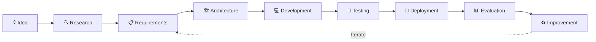

<!-- =========================================================
     SAYAKA ALAM | GITHUB PROFILE README
     Username: SayakaMeem
     Profile: https://github.com/SayakaMeem
========================================================= -->

 

---

# 👩‍💻 About Me

I'm **Sayaka Alam**, a Computer Science & Engineering graduate and software developer interested in building **intelligent, scalable, secure, and user-focused software systems**.

My work spans **software engineering, full-stack development, artificial intelligence, machine learning, computer vision, blockchain, cybersecurity, databases, networking, mobile applications, and research-oriented systems**.

I enjoy transforming ideas into complete applications through the full engineering lifecycle:

### 💡 Idea → 🔍 Research → 🏗️ Design → 💻 Development → 🧪 Testing → 🚀 Deployment → 📊 Evaluation

---

# 🎯 Areas of Focus

---

# 🛠️ Technical Skills

### 👨‍💻 Programming Languages

### 🌐 Frontend Development

### ⚙️ Backend & APIs

### 🤖 AI / ML / Computer Vision

  

`Machine Learning` • `Deep Learning` • `Computer Vision` • `Image Processing` • `Data Analysis`

### 🗄️ Databases

### 🔧 Tools, DevOps & Platforms

---

# 🚀 Project Portfolio

Projects are arranged to highlight **technical depth, completeness, originality, architecture, deployment, and portfolio relevance**.

| # | Project | Domain | Technologies | Description |
|---:|---|---|---|---|
| **01** | [⛓️ EthereumHeist-System](https://github.com/SayakaMeem/EthereumHeist-System) | Blockchain / Analytics / Full-Stack | Python, Blockchain, Data Processing, Web | Blockchain-oriented analytical system combining data processing, backend components, frontend visualization, analytical results, and deployment. |
| **02** | [🔐 RightsChain-X](https://github.com/SayakaMeem/RightsChain-X) | Blockchain / Cybersecurity | Python, FastAPI, JWT, SQLAlchemy, SQLite, SHA-256 | Digital evidence management platform with authentication, RBAC, cryptographic integrity verification, blockchain-inspired traceability, and REST APIs. |
| **03** | [🛒 ComWebP](https://github.com/SayakaMeem/ComWebP) | Full-Stack / E-Commerce | React, Vite, JavaScript, Tailwind, REST API | Responsive e-commerce platform featuring product discovery, authentication, cart, customer/admin roles, order management, APIs, and deployment. |
| **04** | [👗 aura-fashion-ai](https://github.com/SayakaMeem/aura-fashion-ai) | AI / Full-Stack | React, Vite, Node.js, Express, OpenAI API | AI-assisted fashion engineering platform featuring wardrobe management, saved looks, image workflows, recommendations, and AI image transformation. |
| **05** | [✅ TaskFlow](https://github.com/SayakaMeem/TaskFlow) | Full-Stack | React, Vite, Axios, REST API, Vercel | Full-stack task-management application with task creation, completion, reopening, deletion, API communication, and serverless deployment. |
| **06** | [📊 TokenMetricsDB](https://github.com/SayakaMeem/TokenMetricsDB) | Data / Backend | Python, Data Processing | Python-based data-oriented application focused on backend logic, structured data processing, application architecture, and deployment. |
| **07** | [🤖 WordGame-AI](https://github.com/SayakaMeem/WordGame-AI) | Artificial Intelligence / Game AI | Python, Algorithms | Modular AI word-game project separating game flow from intelligent decision-making and algorithmic components. |
| **08** | [🌐 CSE-4106-Lab-7-HTTP-DNS](https://github.com/SayakaMeem/CSE-4106-Lab-7-HTTP-DNS) | Computer Networks | C++, OMNeT++, HTTP, DNS | Network simulation demonstrating DNS resolution followed by HTTP request-response communication. |
| **09** | [⚙️ Compiler_Project85](https://github.com/SayakaMeem/Compiler_Project85) | Compiler Design | C, Compiler Theory | Compiler implementation exploring lexical/language processing, parsing, and fundamental compiler-construction concepts. |
| **10** | [🐾 CryptoPet](https://github.com/SayakaMeem/CryptoPet) | Blockchain / Web | TypeScript, Blockchain | Blockchain-oriented application containing frontend and blockchain-related components. |
| **11** | [👻 GhostHunter](https://github.com/SayakaMeem/GhostHunter) | Game Development | Python, Pygame | Interactive game demonstrating event handling, gameplay mechanics, interface design, and application logic. |
| **12** | [⚡ 8087-Math-CoProcessor](https://github.com/SayakaMeem/8087-Math-CoProcessor) | Digital Systems | Verilog | Hardware-oriented project exploring mathematical coprocessor and digital-system design concepts. |
| **13** | [📱 IOS_assignment](https://github.com/SayakaMeem/IOS_assignment) | iOS Development | Swift, SwiftUI, Xcode | Native SwiftUI application implementing game-state management, user interaction, turn handling, and winner detection. |
| **14** | [🌲 Web_treeverse](https://github.com/SayakaMeem/Web_treeverse) | Web Development | PHP, Laravel | Web-development project demonstrating PHP/Laravel concepts and structured application development. |
| **15** | [🗄️ Database-CRMS-](https://github.com/SayakaMeem/Database-CRMS-) | Database Systems | SQL, DBMS | Database-oriented system demonstrating relational data organization, storage, retrieval, and application/database interaction. |
| **16** | [☀️ WeatherApp](https://github.com/SayakaMeem/WeatherApp) | Application Development | Java | Weather application designed to retrieve and present weather information through a Java application. |
| **17** | [💻 Software-Lab](https://github.com/SayakaMeem/Software-Lab) | Software Engineering | Java | Software-engineering laboratory repository containing Java-based programming and development exercises. |
| **18** | [🌐 Portfolio](https://github.com/SayakaMeem/Portfolio) | Web Development | ASP.NET, HTML, CSS, JavaScript | Personal portfolio project demonstrating frontend development and web-application fundamentals. |
| **19** | [📱 MyApplication85](https://github.com/SayakaMeem/MyApplication85) | Mobile Development | Java | Java-based application demonstrating application and mobile-development concepts. |
| **20** | [☕ Real](https://github.com/SayakaMeem/Real) | Application Development | Java | Java application created for programming and software-development practice. |
| **21** | [🧠 neetcode-submissions](https://github.com/SayakaMeem/neetcode-submissions) | DSA / Problem Solving | C++, Algorithms | Collection of data-structure and algorithm problem-solving submissions. |
| **22** | [🚘 Drowsy-Driver-Detection-System](https://github.com/SayakaMeem/Drowsy-Driver-Detection-System) | Computer Vision | Python, ML, Computer Vision | Driver-drowsiness detection repository maintained as a fork/reference project. |
| **23** | [☕ CoffeeApp](https://github.com/SayakaMeem/CoffeeApp) | iOS Development | Swift | Swift-based iOS application maintained as a fork/reference project. |
| **24** | [🍔 laravel-food-ordering-web-app](https://github.com/SayakaMeem/laravel-food-ordering-web-app) | Web Development | Laravel, PHP, JavaScript | Laravel-based food-ordering application maintained as a fork/reference project. |

> **Note:** Fork/reference repositories are included for completeness but are kept below original engineering projects.

# 📊 GitHub Developer Dashboard

 

> Language statistics reflect the composition of public repositories and are not a direct measurement of proficiency.

---

# 🔥 GitHub Streak

---

# 📊 Development Insights

---

# 🏗️ Engineering Workflow

---

# 🧠 Technical Domains

<table>
<tr>

<td width="25%" align="center">

### 🤖 AI & ML

Machine Learning  
Deep Learning  
Computer Vision  
Intelligent Systems  

</td>

<td width="25%" align="center">

### 💻 Software

Full-Stack  
Backend APIs  
System Design  
Databases  

</td>

<td width="25%" align="center">

### 🔐 Security

Blockchain  
Cybersecurity  
Cryptography  
Data Integrity  

</td>

<td width="25%" align="center">

### 🔬 Research

Applied AI  
Experimental Systems  
Research Software  
Data Analysis  

</td>

</tr>
</table>

---

# 🔬 Currently Exploring

---

# 🐍 Contribution Graph

<picture>
  <source
    media="(prefers-color-scheme: dark)"
    srcset="https://raw.githubusercontent.com/SayakaMeem/SayakaMeem/gh-pages/github-contribution-grid-snake-dark.svg"
  />

  <source
    media="(prefers-color-scheme: light)"
    srcset="https://raw.githubusercontent.com/SayakaMeem/SayakaMeem/gh-pages/github-contribution-grid-snake.svg"
  />

  
</picture>

---

# 🤝 Open to Collaboration

I'm interested in collaborating on projects involving:

- 🤖 Artificial Intelligence & Machine Learning
- 👁️ Computer Vision
- ⛓️ Blockchain Applications
- 🔐 Cybersecurity
- 💻 Full-Stack Development
- ⚙️ Backend & API Engineering
- 📊 Data-Driven Applications
- 🔬 Research Software
- 🌐 Open-Source Projects

---

# 🌐 Connect With Me

<!-- Replace YOUR-LINKEDIN-USERNAME with your actual LinkedIn username -->

---

### Build • Experiment • Research • Learn • Improve

 

 

⭐ **If you find my projects useful, feel free to explore, fork, or star them.**

  

